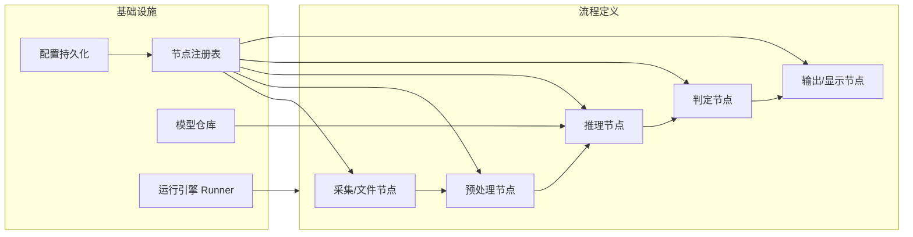

# AI 训练平台架构文档 & 算子流重构路线

> 版本：v0.1 | 日期：2026-08-02
> 目标：以海康 VisionMaster / MVStudio 为参照，梳理当前架构，明确哪些模块向"算子流（Vision Flow）"方向重构。
> 版本：v0.1 | 日期：2026-08-02
> 目标：以海康 VisionMaster / MVStudio 为参照，梳理当前架构，明确哪些模块向"算子流（Vision Flow）"方向重构。

---

## 〇、实施进度（2026-08-02 更新）

| 阶段 | 状态 | 说明 |
|:---|:---|:---|
| P0 数据模型与引擎 | ✅ 完成 | `flow/` 包：Frame/Node/Registry/Runner/Flow，DAG 拓扑执行 |
| P1 推理节点化 | ✅ 完成 | `cls_infer`/`det_infer`/`seg_infer`/`ocr_infer`/`ocv_infer` + 对应结果写出节点；`flow/batch.py` 批量执行器；`main_window.py` 四个批量推理函数迁出（seg/det/ocr/ocv），UI 只保留信号胶水 |
| P2 流程编辑 UI | ✅ v1 完成 | `ui/flow_editor.py`：节点库拖拽、画布连线、参数面板、方案保存/加载、单图运行（Tools → Flow Editor...） |
| P3 采集与工业通信 | ⬜ 待办 | CameraSource / MESPush / PLCTrigger / ResultToExcel |


---

## 一、当前架构总览

### 1.1 模块清单

| 目录/文件 | 行数 | 职责 | 现状评价 |
|:---|:---|:---|:---|
| `ui/main_window.py` | 4136 | 主窗口：菜单/面板/列表/训练/推理/预览全部逻辑 | ⚠️ 上帝对象，UI 与业务严重耦合 |
| `ui/mixed_viewer.py` | 175 | 混合分类双视口预览（灰度+高度图） | 独立组件，可复用 |
| `ui/mixed_add_dialog.py` | 185 | 混合分类"添加图片"配对弹窗 | 独立组件 |
| `ui/crop_tool.py` / `ui/resize_tool.py` | 296/200 | 图像循环裁剪 / 缩放工具 | 独立工具类 |
| `ui/system_monitor.py` | 94 | 系统资源监控 | 独立组件 |
| `core/project_manager.py` | 117 | 项目创建/打开/自定义目录注册 | ✅ 良好，保持 |
| `core/config.py` | 28 | 全局配置加载 | 简单，可扩展 |
| `annotation/` | ~2000 | 标注画布、LabelMe IO、版本管理、SAM | ✅ 领域独立，保持 |
| `classification/` | ~1600 | 分类数据集/训练器/Grad-CAM/双模态/评估 | ⚠️ 训练与推理逻辑交织 |
| `detection/` | ~1400 | 检测标注/COCO/训练 | ⚠️ 同上 |
| `training/`（分割） | ~1000 | 分割训练/损失/增强 | ⚠️ 同上 |
| `inference/predictor.py` | 527 | PyTorch/TensorRT/ONNX 推理引擎 | ✅ 已有多后端抽象，重点演进 |
| `ocr/` | 177 | OCR 推理管线 | 可封装为节点 |
| `ocv/inspector.py` | 174 | OCV 特征嵌入质检 | 可封装为节点 |
| `scripts/` | 40+ 个 | 一次性修复脚本 | ⚠️ 技术债信号，勿再增长 |

### 1.2 当前数据流（以图像分类为例）

```mermaid
flowchart LR
    A[项目打开] --> B[图片扫描 images/]
    B --> C[列表渲染 _render_page]
    C --> D[画布预览 canvas]
    E[标注 JSON] --> C
    F[训练器 train()] --> G[模型 checkpoint]
    G --> H[批量推理 run()]
    H --> I[结果 dict]
    I --> J[列表结果列刷新]
    I --> K[热力图生成]
    K --> L[画布叠加显示]
```

### 1.3 核心问题诊断

1. **逻辑全部挂在 `main_window.py`**：训练、推理、结果回调、热力图、列表刷新都靠信号/回调串在 UI 里，无法脱离界面复用，也无法并行编排。
2. **推理结果是"一次性内存 dict"**：`_cls_predictions` / `results` 用完即弃（虽已补了 json 持久化，但缺少统一结果数据结构）。
3. **算法与流程耦合**：每类任务（分类/检测/分割/OCR/OCV）都有自己的 train/predict 入口，重复代码多，无法组合（如"先定位再裁剪再分类"）。
4. **无"方案"概念**：海康平台的核心是"方案（Flow）"——一组算子按 DAG 连接，可保存、可复跑。当前平台是硬编码调用链。
5. **采集与输出缺失**：无相机接入、无 PLC/MES 通信，只能"文件进、文件出"。

---

## 二、目标架构：算子流（Vision Flow）

### 2.1 核心概念

- **算子节点（Node）**：最小可复用单元，有输入端口、输出端口、参数 Schema、可序列化配置。
- **流程（Flow/方案）**：节点按 DAG 连接，定义数据如何流转；可保存为 JSON、可复跑、可版本管理。
- **统一数据载体（Frame）**：节点间传递的标准对象（图像、ROI、数组、结果、标注、元数据），避免各类任务私自定义 dict。
- **运行引擎（Runner）**：按拓扑序执行 DAG，支持单次/循环/停止/断点，与 UI 解耦（可无头运行）。



### 2.2 节点类型规划（对齐海康算子体系）

| 节点类别 | 海康对应 | 本平台候选节点 |
|:---|:---|:---|
| 采集 | 图像源/相机 | `FileSource`（文件夹/单图）、`CameraSource`（海康 MVS / 基恩士 3D） |
| 预处理 | 图像预处理 | `GrayConvert`、`Resize`（复用 resize_tool）、`HeightMapRainbow`（高度图彩虹映射）、`Normalize` |
| 算法 | 定位/测量/检测 | `ClsInfer`（分类，复用 classification trainer.predict）、`DetInfer`（检测）、`SegInfer`（分割）、`OCR`、`OCV` |
| 可视化 | 结果显示 | `HeatmapOverlay`（Grad-CAM）、`BoxOverlay`、`AnnotationOverlay` |
| 判定 | 逻辑/结果判定 | `ThresholdJudge`（按 Score/置信度/高度值出 OK/NG）、`MultiClassMap` |
| 输出 | 通讯/数据 | `ResultToExcel`、`ResultToJson`、`MESPush`、`PLCTrigger`（Modbus/TCP） |

---

## 三、重构路线：哪些模块往算子流方向改

### ✅ P0 —— 数据模型与引擎（地基，先做）

| 模块 | 动作 | 说明 |
|:---|:---|:---|
| 新增 `flow/` 包 | 新建 | `frame.py`（统一数据载体）、`node.py`（节点基类）、`registry.py`（注册表）、`runner.py`（DAG 执行引擎）、`schema.py`（参数序列化） |
| `core/project_manager.py` | 保持不动 | 仅补充：项目目录下新增 `flows/` 子目录存放方案 JSON |
| 现有算法模块 | 只读不改 | 先不重构 train/predict 内部，只包壳 |

**落地标准**：定义 `Frame`（含 image、roi、tensor、result、meta）、`Node` 基类（`run(frame) -> frame`）、`Flow`（节点列表+DAG 边），跑通"文件→缩放→灰度"最小流程单元测试。

### ✅ P1 —— 把现有推理封装成节点（打通最小闭环）

| 模块 | 动作 | 说明 |
|:---|:---|:---|
| `classification/trainer.py` | 包壳 | 新增 `flow/nodes/classification.py`，`ClsInferNode` 复用 `predict_single()`，导出 class/confidence |
| `inference/predictor.py` | 包壳 | `DetInferNode` / `SegInferNode` 复用多后端推理（PyTorch/TRT/ONNX） |
| `ocr/pipeline.py`、`ocv/inspector.py` | 包壳 | `OCRNode`、`OCVNode` |
| `ui/main_window.py` | 减负 | 批量推理逻辑迁到 `flow/runner.py`，UI 只保留按钮/进度/回调绑定 |

**落地标准**：`python -m flow.run --flow demo_cls_flow.json` 可无头跑完"读图→分类→热力图→写 JSON"，与现有界面批量推理结果一致。现有 UI 不动，双轨并行。

### ✅ P2 —— 可视化与流程编辑 UI

| 模块 | 动作 | 说明 |
|:---|:---|:---|
| 新增 `ui/flow_editor.py` | 新建 | 节点画布：拖拽节点、连线、参数面板（复用 QDoubleSpinBox 等既有控件）、运行/停止按钮 |
| `ui/main_window.py` | 减负 | 预览/结果叠加改为订阅 `Frame.result`，热力图/彩虹图渲染抽成节点 |
| `annotation/mask_editor.py` | 保持不动 | 标注是独立领域，不参与算子流 |

**落地标准**：在编辑器里拖 3 个节点（FileSource → ClsInfer → HeatmapOverlay）连线保存为方案，重新打开可复跑。

### ✅ P3 —— 采集与工业通信（对齐海康生产场景）

| 模块 | 动作 | 说明 |
|:---|:---|:---|
| 新增 `flow/nodes/acquire.py` | 新建 | `CameraSource`：海康 MVS SDK / 基恩士 3D SDK 接入，软触发/连续采集 |
| 新增 `flow/nodes/io.py` | 新建 | `MESPush`（HTTP/JSON）、`PLCTrigger`（Modbus TCP）、`ResultToExcel`（复用 openpyxl） |
| `inference/trt_*.py` | 演进 | 推理性能：TensorRT FP16 批量、显存池 |

---

## 四、保持不动的部分（不要为重构而重构）

- `annotation/`（标注画布、LabelMe IO、版本管理）——领域独立，海康也没有更好的。
- `core/project_manager.py`——职责单一。
- `ui/crop_tool.py`、`ui/resize_tool.py`——它们本身就是"单算子"工具，未来可直接平移到节点壳里。
- `scripts/` 一次性脚本——不迁移，只停止新增（建议后续清理）。

## 五、配套功课（配合重构）

1. **数据契约先行**：先定 `Frame` 字段规范（图像格式约定、ROI 坐标系、结果结构），避免节点间私货。
2. **方案 JSON 版本化**：Flow 文件带 `version` 字段，向后兼容。
3. **无头可测**：每个节点可独立单测（喂 Frame 断言输出），这是海康方案"可复现"的保证。
4. **性能预算**：相机接入后，帧率是关键指标；Runner 需要支持并发节点（N1 采集与 N3 推理流水线化）。

---

## 六、建议实施顺序（四周节奏）

| 周次 | 产出 |
|:---|:---|
| W1 | ✅ `flow/` 数据模型 + Runner 骨架，跑通最小流程 |
| W2 | ✅ Cls/Det/Seg/OCR/OCV 节点化，批量推理从 UI 迁出（`flow/batch.py`） |
| W3 | ✅ 流程编辑器 v1（拖拽+连线+参数+保存/加载，`ui/flow_editor.py`）；⏳ 热力图/彩虹图节点化待做 |
| W4 | ⬜ 文件采集+判定+Excel 输出节点，产出第一份"方案模板"；后续再接相机 SDK |